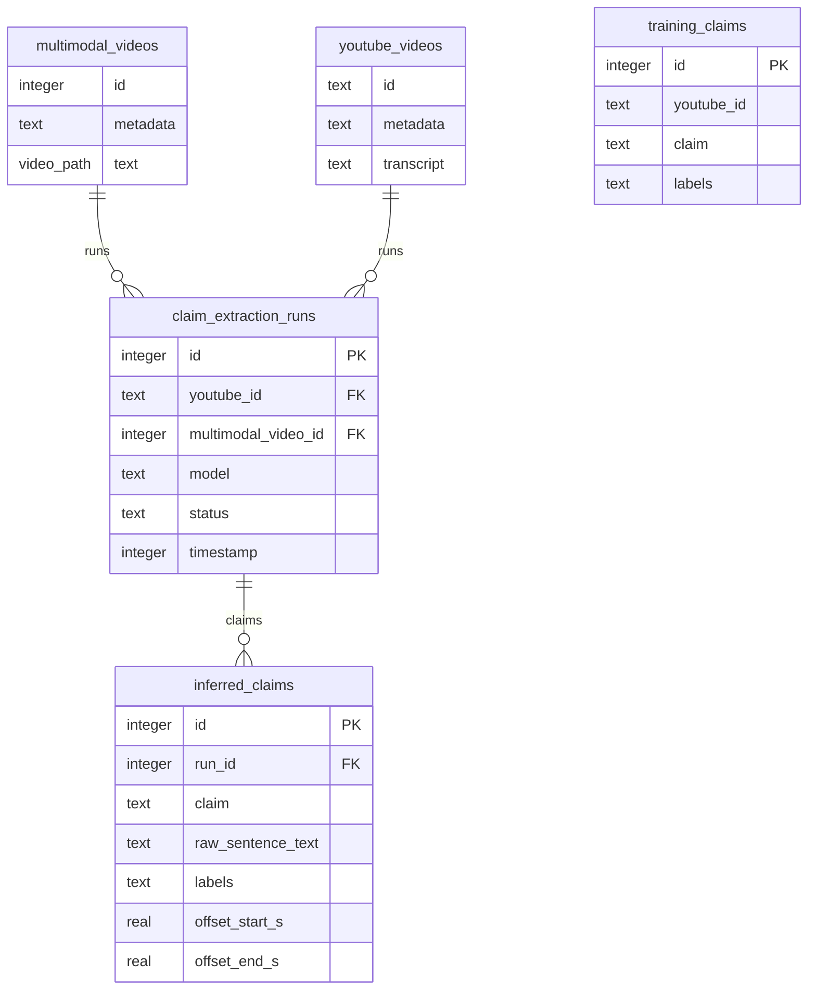

# Raphael health misinformation project

(Respository shared by Full Fact and Google for work on a proof-of-concept)

## Getting started

To run the app locally, you’ll need python, poetry and node installed. If you want to reinitialise the database, delete your local database.db. Then:

1. Install backend dependencies:
   ```
   poetry install --no-root
   ```

To start the development servers:

1. Start the backend development server with:
   ```
   PYTHONPATH=src poetry run python -m raphael_backend_flask.app
   ```
2. In a browser, visit http://localhost:3000. Login details for a freshly initalised database are: `fullfact` / `changeme`.

### Running locally with Docker

Very roughly:

```
cp .env.example .env  # and populate this
docker build -t fullfact/raphael-backend:latest -f Dockerfile.backend .
docker compose up -d
```

## Downloading some captions

Use `youtube_api.py` to search by keywords and extract captions to a local filestore, in `data/captions`. Currently set up to prefer English-language captions, though we should aim to be language agnostic in production. The location of the `CLIENT_SECRETS_FILE` needs to be set as an environment variable. ([How to get the credentials](https://developers.google.com/youtube/v3/quickstart/python))

## Extract claims

Use `vertex.py` to load in a set of captions and pass to a off-the-shelf LLM (e.g. Gemini) to identify health-related claims. This can be used to create a spreadsheet for manual-labelling of noteworthy claims.

## Fine-tuning

Use `fine_tuning.py` to fine-tune a model and get responses from it.

`make_training_set()` loads a CSV file of training data and re-format, ready to fine-tune a model.

`tuning()` carries out the fine-tuning. This starts a remote job that takes c.45 minutes.

`get_video_responses()` uses a fine-tuned model to generate reponses to the transcript of a video.

`construct_in_context_examples()` uses in-context learning (where the training data is included in the prompt) as an alternative to fine-tuning. It is faster, so good for iterating on prompt designs.

## Model types

**simple-type** model: given a transcript, it is trained to return a list of harmful health-related claims

**explaination-type** model: given a transcript, it is trained to return a list of health-related claims with an explanation label predicting how checkworthy it is and why. These labels (for concepts like "high harm", "cites study" etc.) allow us to add expert knowledge into the training data.

**multi-label** model: emulates fact checking expertise by identifying features of a claim, such as its readability, whether it is recommending actions and so on. These can later be used to predict checkworthiness.

## Deploy/update a server

For code changes, branches are deployed via a [GitHub Actions workflow dispatch](https://github.com/FullFact/health-misinfo-shared/actions/workflows/ci.yml).

The process for making nginx changes is a bit more involved:

1. Install Ansible
   ```
   poetry run pip install ansible
   ```
2. Install the necessary roles:
   ```
   poetry run ansible-galaxy install -r ansible/requirements.yml
   ```
2. Run:
   ```
   poetry run ansible-playbook -i ansible/inventories/hosts ansible/playbooks/nginx_docker.yaml
   ```

## User management

Users are stored in the database. To add a user, assuming the application is running on `http://127.0.0.1:3000` and the username:password you're using is `fullfact:changeme`:

### Adding a user (admin only)
```sh
curl http://127.0.0.1:3000/api/register -i -X POST \
  -u fullfact:changeme \
  -F username=alice \
  -F password=abc123 \
  -F admin=on  # this line is optional, marks a user as admin
```

### Disabling a user (admin only)
```sh
curl http://127.0.0.1:3000/api/users/alice -i -X DELETE \
  -u fullfact:changeme
```
Note that this disables a user but does not delete it. 

### Changing a user's password (admin only)
only for this mvp (as a product users should control their own credentials)
```sh
curl http://127.0.0.1:3000/api/users/alice -i -X PATCH \
  -u fullfact:changeme \
  -F password=newpassword
```

When using above calls on the live demo version, the user/password specified by `-u` should be the main `fullfact` account (password in Bitwarden); and the URL should be `https://raphael.fullfact.org/api/` etc. 
 
## Getting claims for YouTube captions

For building a set of labelled data, we want to get health claims, without all the other stuff we're predicting.
The `find_claims_within_captions.py` script takes our downloaded YouTube captions and asks Gemini to find all the claims contained within.

> Note on Gemini 1.5: to use this version you have to specify `gemini-1.5-pro-preview-0409` rather than just `gemini-1.5-pro` like you would for 1.0.

## Writing new prompts

We introduce all prompts with a persona, outlining that the model will be acting as a specialist health fact-checker. If new prompts are written, ensure the following passage is added to the front:

> You are a specialist health fact-checker.
>
> You must always prioritise accuracy, and never give a response you cannot be certain of, because you know there are consequences to spreading misinformation, even unintentionally.
>
> You would always rather say that you do not know the answer than say something which might be incorrect.

## Claim scoring

Claims with a multi-label classifications are scored.
Each possible label gets a score, and each feature gets a weight.
The label score and weight are multiplied, and the weighted scores summed.
Scores can have a maximum of 310 and a minimum of -435; although this could change if individual scores and weights are amended.
There is a threshold for the summary labels "not worth checking" (-435 to 100), "may be worth checking" (101 to 200) and "worth checking" (201 to 310).
These thresholds can also be amended.
The scores and weights can be found in [the label scoring file](src/health_misinfo_shared/label_scoring.py).

## Database schema


